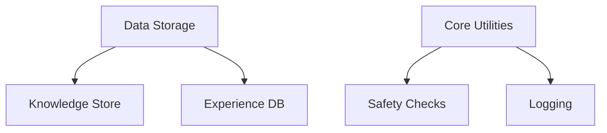
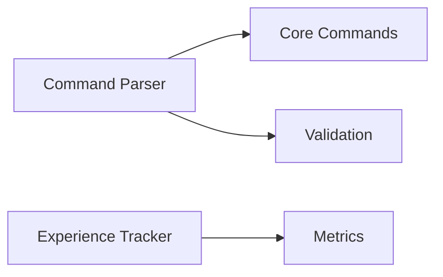
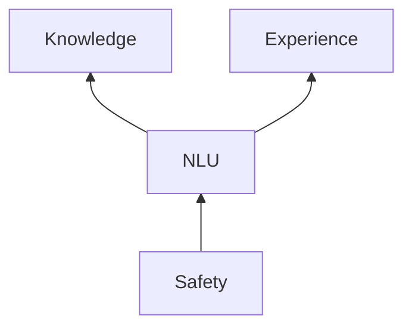
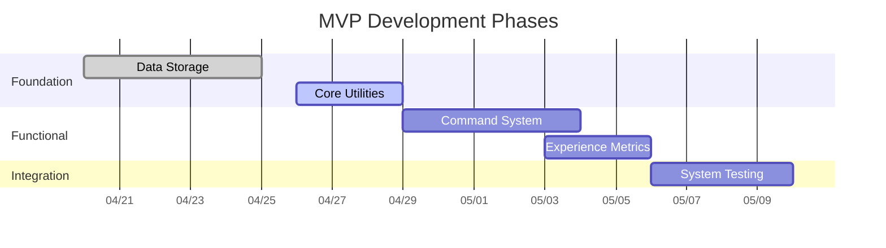

# AgentHope MVP Roadmap

## Foundation Layer (Week 1)

| Task | Est. Hours | Depends On | Status |
|------|------------|------------|--------|
| Knowledge CRUD operations | 4 | - | ✅ Done |
| Experience recording | 3 | - | ✅ Done |
| Basic safety validation | 2 | - | ⏳ 50% |
| Unified logging | 2 | Safety | ❌ |

## Functional Layer (Week 2)

| Task | Est. Hours | Depends On | Status |
|------|------------|------------|--------|
| Basic command set | 3 | Foundation | ✅ |
| Command validation | 2 | Core Commands | ⏳ |
| Success/failure tracking | 3 | Experience DB | ❌ |
| Bulk knowledge ops | 2 | Knowledge Store | ❌ |

## Integration Layer (Week 3)

| Task | Est. Hours | Depends On | Status |
|------|------------|------------|--------|
| Context-aware parsing | 4 | Core Commands | ❌ |
| Experience analysis | 3 | Metrics | ❌ |
| Safety integration | 3 | Validation | ❌ |

## Workflow Optimization
1. Complete all Foundation tasks first
2. Parallelize Functional tasks where possible
3. Integrate components only after dependencies are stable

## Progress Dashboard

